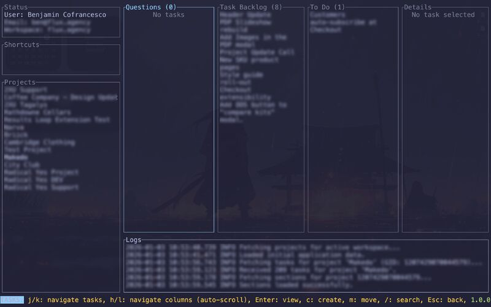

# Asana TUI



Terminal user interface for managing Asana tasks and projects.

## Installation

```bash
git clone https://github.com/bej-cofrancesco/asana-tui.git
cd asana-tui
cargo build --release
```

## Usage

```bash
cargo run --release
```

On first run, you'll be prompted to enter your Asana API token. Configuration is stored at:
- macOS/Linux: `~/.config/asana-tui/config.yaml`
- Windows: `%APPDATA%\asana-tui\config.yaml`

## Development

```bash
cargo check
cargo test
cargo fmt
cargo clippy
```

## License

MIT
